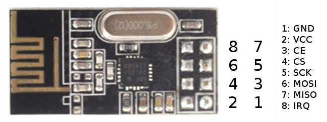
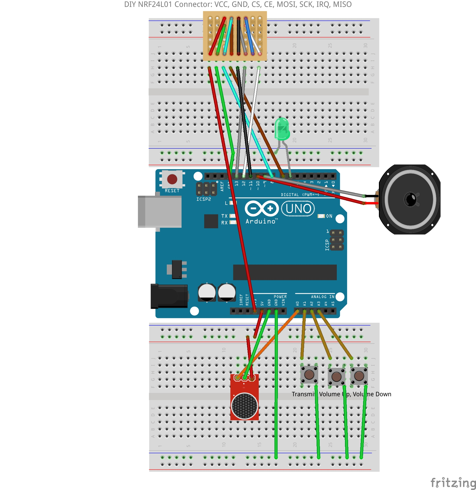
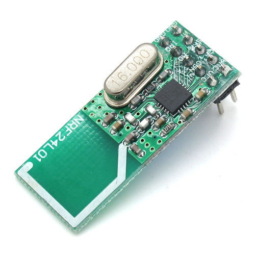
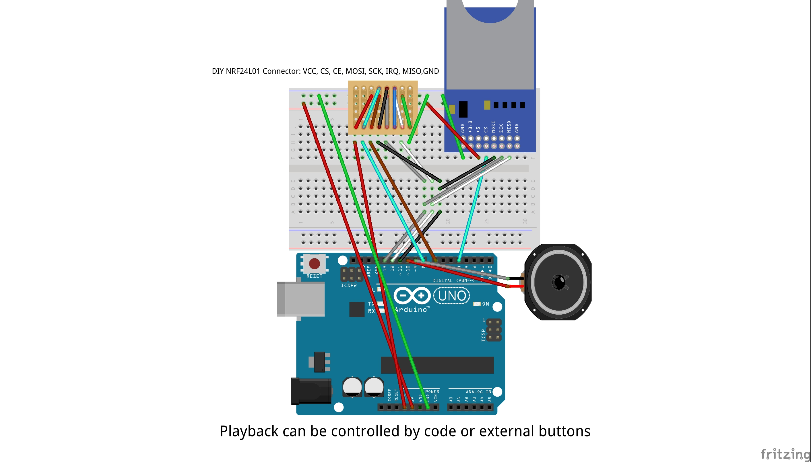

# Setup Boards & Wiring

## Board Wiring

This page displays different options for wiring/board configuration.

{height=25% width=25%}

Wiring diagram for DIY module connector. May not be needed depending on module:

{height=45% width=45%}

{height=20% width=20%}

{height=45% width=45%}

Wiring diagram for SD streaming/multicast using TMRpcm library:

{height=65% width=65%}
